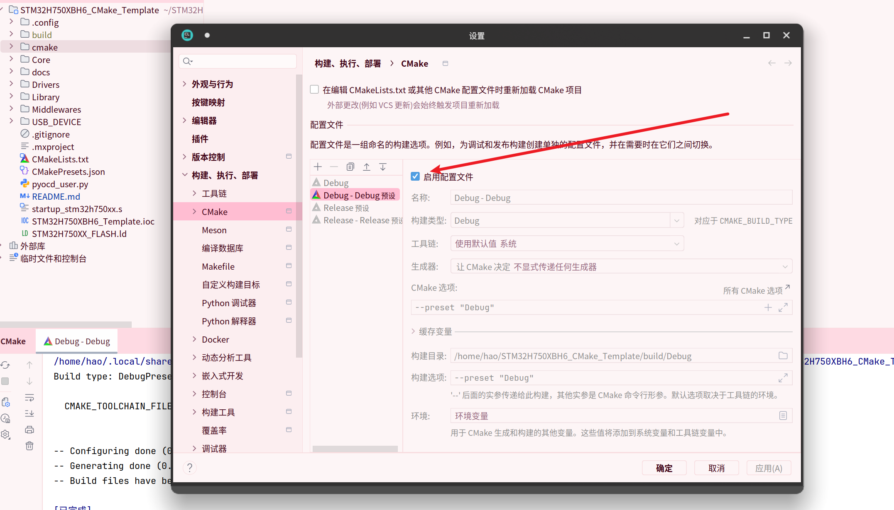
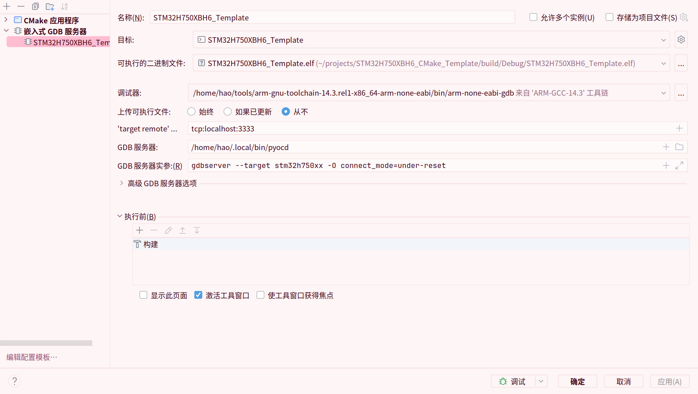
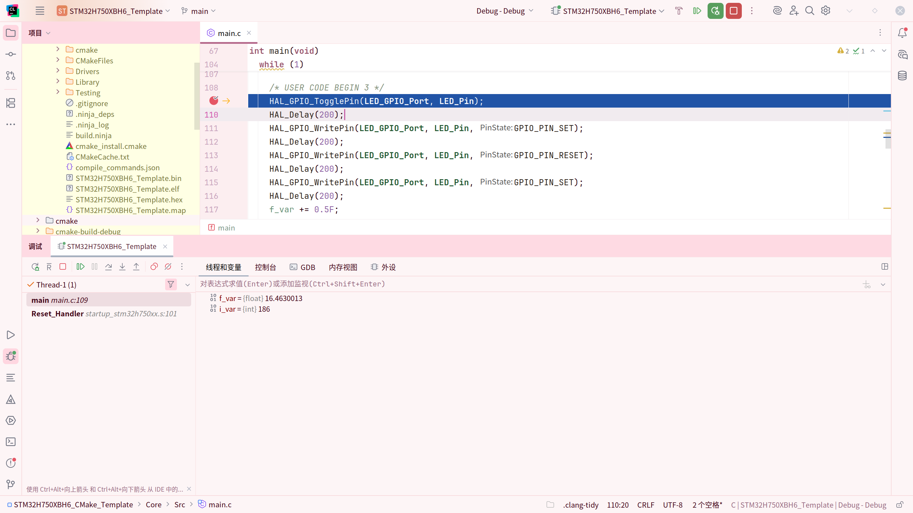

## 一、使用Clion进行开发和编译

导入项目后，在CMake设置中启用`Debug-Debug预设`（或者Release），即可调用`CMakePresets.json`中的预设。随后便可以进行CMake工程配置、编译、文件检索、错误检查和补全。



## 二、使用Clion进行烧录

#### 使用终端

最通用的做法（

在终端中执行

```bash
pyocd flash --target stm32h750xx -O connect_mode=under-reset ./build/Debug/STM32H750XBH6_Template.bin@0x90000000
```

#### 使用Clion服务

待补充

## 三、使用Clion调试

未补充完，待后续更新

---

Clion结合pyOCD调试运行在外部flash中的程序

需要的信息

- arm-none-eabi-gdb的位置（如果是linux，软件包管理器安装的开发工具不带gdb，建议去[arm官网](https://developer.arm.com/downloads/-/arm-gnu-toolchain-downloads)下载）
- pyocd的位置

按照图片填写信息，在调试之前，需要烧录对应的elf文件



效果展示：

